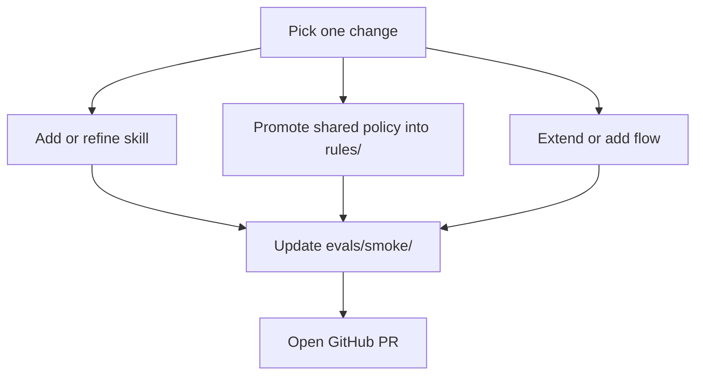

# Contributing to asic-ai-workflows

Thanks for helping improve the structured workflow library behind
`asicdesign.ai`.

This repository is for reusable AI engineering artifacts, not general product
marketing copy or portal-only presentation work.

## Core repo concepts

`skill`

- A narrowly scoped AI task for one engineering problem.
- Lives in `skills/*/SKILL.md` and should define clear inputs, behavior, and
  structured outputs.

`rule`

- Shared engineering policy, grounding, or classification logic reused by more
  than one skill or flow.
- Lives under `rules/`.

`flow`

- A multi-step workflow that composes multiple skills and rules into one larger
  artifact.
- Lives under `flows/`.

`schema`

- A machine-checkable contract for structured outputs or artifacts.
- Lives under `schemas/`.

`dataset`

- Example inputs and fixtures used to exercise the current skills and flows.
- Lives under `datasets/fixtures/`.

`eval`

- Smoke metadata and golden outputs used to validate the current repo shape and
  artifacts.
- Lives under `evals/smoke/`.

## When to add a new rule

Add or extend a rule when the behavior is shared, reusable, and should stay
consistent across multiple skills or flows.

Keep the logic in the skill itself when it is:

- specific to one task
- only relevant to one skill
- not yet stable enough to become shared repo policy

When a matching rule already exists in the same domain, extend that rule instead
of creating a near-duplicate file.

## Contribution expectations

- Keep outputs structured and evidence-grounded.
- Do not make capabilities sound broader than the current repo actually
  supports.
- Update references when you rename or move artifacts.
- Prefer concrete, testable constraints over vague guidance.

When you add a new skill or flow, also add the matching schema and smoke assets
when they are part of the artifact contract.

## Local validation

Run the same checks the repo uses in CI:

`python3 scripts/repo_lint.py`

`python3 scripts/check_structured_files.py`

`python3 scripts/check_skill_contracts.py`

`python3 scripts/check_flow_contracts.py`

`python3 scripts/check_eval_smoke.py`

If you changed YAML handling locally, install `PyYAML` first so
`check_structured_files.py` can run:

`python3 -m pip install PyYAML`

## Pull requests

This repo already includes a PR template in `.github/pull_request_template.md`.
Please follow it.

Contribution flow:

In your PR description, include:

- what artifact type you changed
- why the change belongs in this repo
- what validation commands you ran
- whether you added or updated schemas, fixtures, or smoke outputs

## Before opening a PR

- read `README.md`
- inspect the affected `SKILL.md`, `FLOW.md`, or rule files directly
- keep shared policy in `rules/` instead of duplicating it across skills
- preserve evidence grounding and stable structured output contracts
